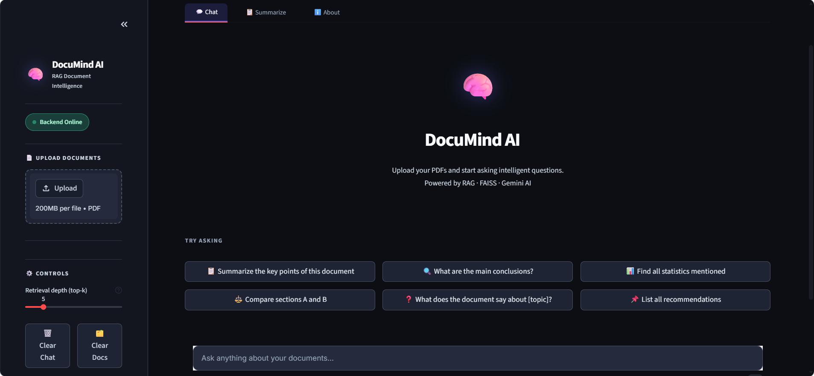
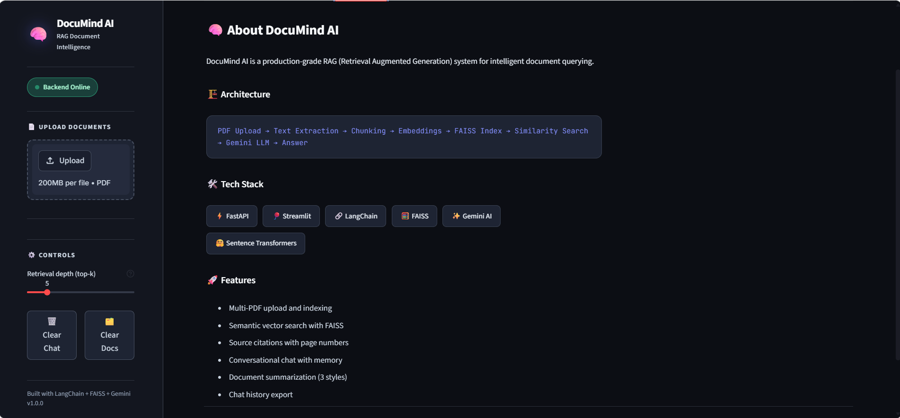
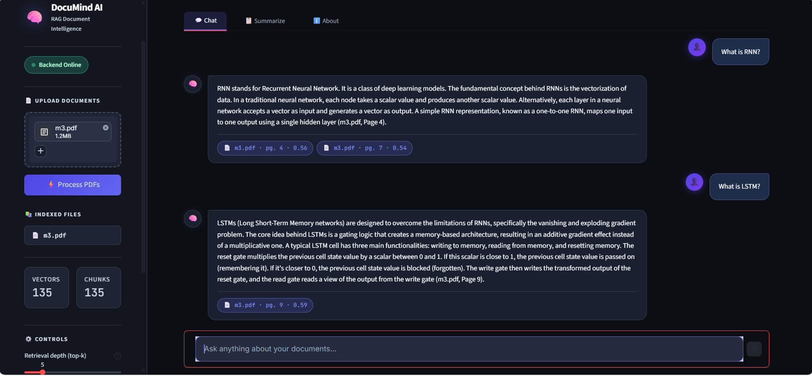
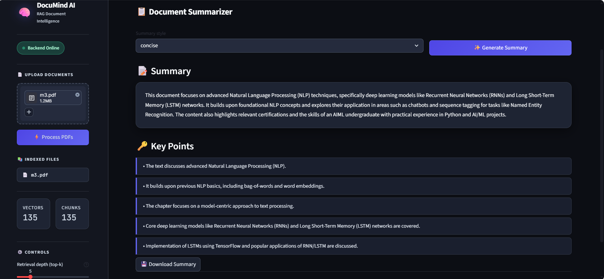

# DocuMind AI – RAG Based Document Query System

An AI-powered document assistant built using **FastAPI, Streamlit, FAISS, LangChain, Sentence Transformers, and Gemini AI**.  
The system allows users to upload PDF documents and interact with them using natural language queries through Retrieval-Augmented Generation (RAG).

---

# 🚀 Features

- 📄 Multi-PDF Upload & Processing
- 🔍 Semantic Search using FAISS
- 🤖 AI-Powered Question Answering
- 🧠 RAG (Retrieval-Augmented Generation)
- 📚 Source Citation with Page Numbers
- ✨ Document Summarization
- 💬 Conversational Chat Interface
- 🎨 Modern Dark UI using Streamlit
- ⚡ FastAPI Backend
- 🔎 Similarity Score Retrieval
- 🗂 Chunk-based Vector Embeddings

---

# 🏗️ System Architecture

```text
PDF Upload
    ↓
Text Extraction
    ↓
Chunking
    ↓
Sentence Embeddings
    ↓
FAISS Vector Database
    ↓
Semantic Retrieval
    ↓
Gemini LLM Response Generation
```

---

# 🛠️ Tech Stack

## Frontend
- Streamlit
- Custom CSS

## Backend
- FastAPI
- Python

## AI / ML
- Gemini AI
- LangChain
- Sentence Transformers
- FAISS

## Database
- FAISS Vector Store

---

## 📸 Screenshots

### 🏠 Home Page


---

### 📘 About Page


---

### 💬 AI Chat Interface


---

### 📄 Document Summarization



# 📂 Project Structure

DOCUMIND-AI
│
├── data/
│   └── uploads/
│       ├── notes    
│
├── documind-ai/
│   │
│   ├── .streamlit/
│   │   └── config.toml
│   │
│   ├── backend/
│   │   ├── routes/
│   │   ├── services/
│   │   ├── utils/
│   │   └── main.py
│   │
│   ├── frontend/
│   │   ├── styles/
│   │   │   └── main.css
│   │   │
│   │   └── app.py
│   │
│   ├── vectorstore/
│   │   ├── faiss_index.index
│   │   └── metadata.pkl
│   │
│   ├── README.md
│   ├── render.yaml
│   ├── requirements.txt
│   └── setup.sh
│
├── screenshots/
│   ├── about_page.png
│   ├── chat_interface.png
│   ├── document_summarization.png
│   └── home_page.png
│
├── .gitignore
└── README.md
```

---

# ⚙️ Installation

## 1️⃣ Clone Repository

```bash
git clone https://github.com/r-sanjana/DocuMind-AI-RAG-based-document-query-system.git
cd DocuMind-AI-RAG-based-document-query-system
```

---

## 2️⃣ Create Virtual Environment

```bash
python -m venv venv
```

### Activate Environment

#### Windows

```bash
venv\Scripts\activate
```

#### Linux / Mac

```bash
source venv/bin/activate
```

---

## 3️⃣ Install Dependencies

```bash
pip install -r requirements.txt
```

---

# 🔑 Environment Variables

Create a `.env` file in root directory:

```env
GOOGLE_API_KEY=your_gemini_api_key
```

Get API Key from Google AI Studio:
https://aistudio.google.com/app/apikey

---

# ▶️ Running the Project

## Start Backend

```bash
uvicorn backend.main:app --reload
```

Backend runs on:

```text
http://localhost:8000
```

---

## Start Frontend

```bash
streamlit run frontend/app.py
```

Frontend runs on:

```text
http://localhost:8501
```

---

# 💡 Example Queries

- What is RNN?
- Explain LSTM from the document
- Summarize this PDF
- What projects are mentioned in this resume?
- Find all statistics mentioned
- Compare sections A and B

---

# 📸 Screenshots

## Upload & Chat Interface

(Add screenshot here)

## AI Response with Source Citation

(Add screenshot here)

## Document Summarization

(Add screenshot here)

---

# 🔍 How It Works

1. User uploads PDF documents
2. Text is extracted and chunked
3. Chunks are converted into embeddings
4. Embeddings are stored in FAISS
5. User query is converted into embedding
6. Most relevant chunks are retrieved
7. Gemini AI generates contextual response
8. Source pages and similarity scores are displayed

---

# 📈 Future Improvements

- 🌐 Multi-language support
- 📑 DOCX and TXT support
- 🔊 Voice-based querying
- ☁️ Cloud deployment
- 🧠 Chat memory improvements
- 📊 Analytics dashboard

---

# 👩‍💻 Author

## Sanjana R

- AIML Engineering Student

GitHub:
https://github.com/r-sanjana

---
